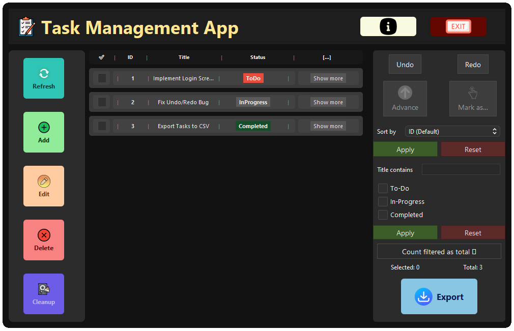
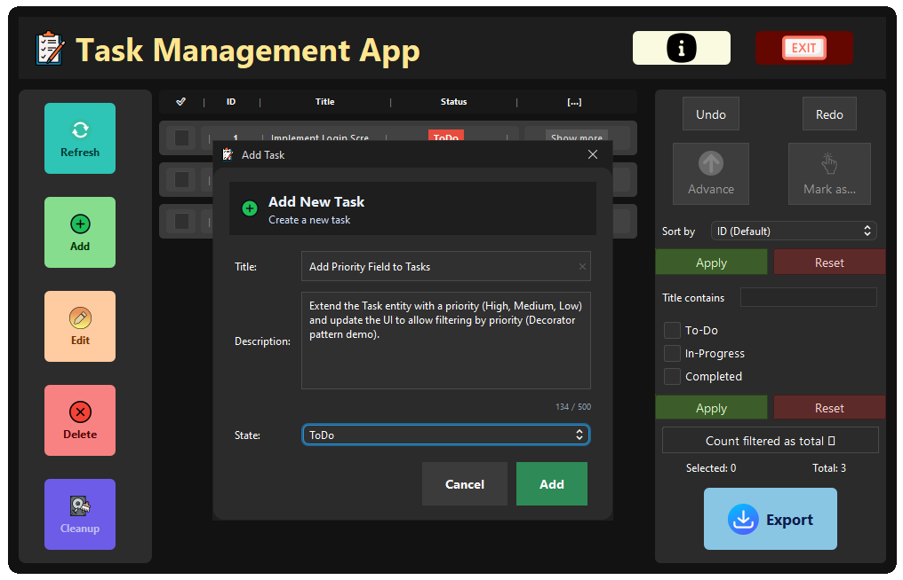
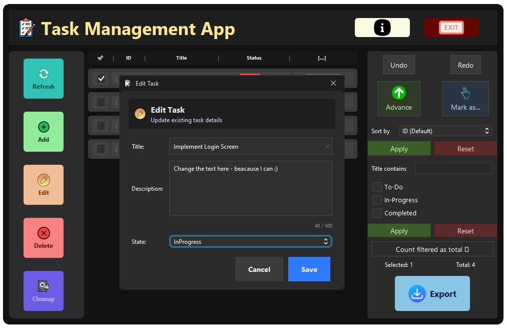
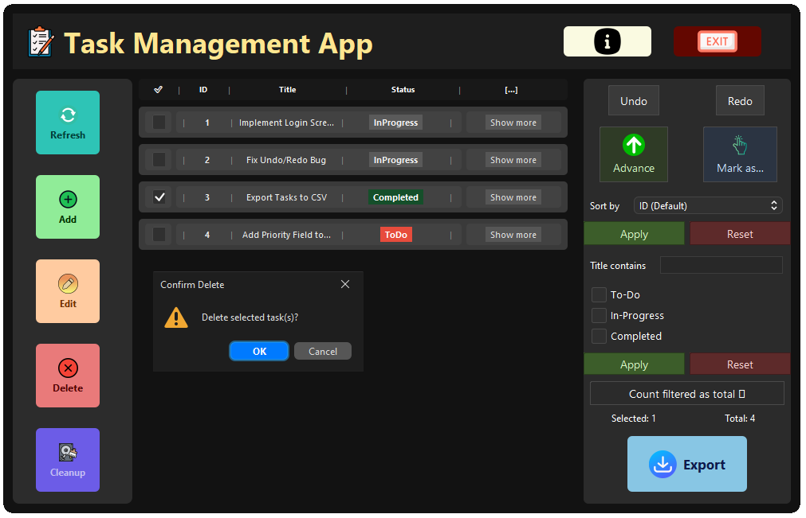
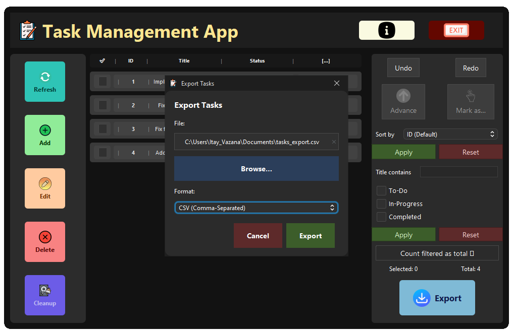

# 🗂️ Tasks Management Application

A standalone **Java 24 desktop application** for managing tasks with:
* A clean **MVVM architecture** for separation of concerns.
* **Swing UI** for user interaction.
* **Embedded Apache Derby** for persistence.

The app provides an intuitive interface to create, edit, delete, filter, and track tasks through their lifecycle, with full undo/redo and reporting support.


---

## ✨ Features
- ➕ Create, ✏️ Edit, 🗑️ Delete tasks  
- 📌 Task states: **To Do → In Progress → Completed** (State pattern)  
- ↩️ **Undo / Redo** for all operations (Command pattern)  
- 🔍 **Filtering** with combinator logic (AND / OR)  
- 📑 **Sorting strategies** (by ID, Title, State – Strategy pattern)  
- 📊 **Reports & Export** to **CSV** / **TXT** (Visitor + Records & Pattern Matching)  
- 🔔 Automatic UI refresh on model changes (Observer pattern)  
- 💾 Persistent storage with **embedded DerbyDB** – no external setup required  

---

## 📂 Project Structure
- `src/taskmanagement/` → Application code (Model, ViewModel, UI)
- `src/test/taskmanagement/` → Unit tests (JUnit)
- `out/artifacts/Task_Management_Application_jar/TaskManagementApplication.jar` → Built executable JAR

---

## 🛠️ Project Architecture

```
Task_Management_Appliction/
├── lib/
│   ├── derby.jar
│   ├── derbyshared.jar
│   ├── derbytools.jar
│   ├── flatlaf-3.6.jar
│   ├── hamcrest-core-1.3.jar
│   └── junit-4.13.2.jar
└── src/
    ├── taskmanagement/
    │   ├── app/
    │   │   └── App.java
    │   ├── application/
    │   │   └── viewmodel/
    │   │       ├── ExportFormat.java
    │   │       ├── TasksViewModel.java
    │   │       ├── commands/
    │   │       │   ├── AddTaskCommand.java
    │   │       │   ├── Command.java
    │   │       │   ├── CommandException.java
    │   │       │   ├── CommandStack.java
    │   │       │   ├── DeleteTaskCommand.java
    │   │       │   ├── MarkStateCommand.java
    │   │       │   └── UpdateTaskCommand.java
    │   │       ├── events/
    │   │       │   ├── ObservableList.java
    │   │       │   └── Property.java
    │   │       └── sort/
    │   │           ├── SortById.java
    │   │           ├── SortByState.java
    │   │           ├── SortByTitle.java
    │   │           └── SortStrategy.java
    │   ├── domain/
    │   │   ├── ITask.java
    │   │   ├── Task.java
    │   │   ├── TaskState.java
    │   │   ├── exceptions/
    │   │   │   └── ValidationException.java
    │   │   ├── filter/
    │   │   │   ├── Filters.java
    │   │   │   └── ITaskFilter.java
    │   │   └── visitor/
    │   │       ├── CountByStateVisitor.java
    │   │       ├── ITaskVisitor.java
    │   │       ├── TaskVisitor.java
    │   │       ├── adapters/
    │   │       │   ├── ByStateCsvExporter.java
    │   │       │   ├── ByStatePlainTextExporter.java
    │   │       │   └── IReportExporter.java
    │   │       ├── export/
    │   │       │   ├── CompletedTaskRec.java
    │   │       │   ├── CsvFlatTaskVisitor.java
    │   │       │   ├── ExportNode.java
    │   │       │   ├── InProgressTaskRec.java
    │   │       │   ├── PlainTextFlatTaskVisitor.java
    │   │       │   └── ToDoTaskRec.java
    │   │       └── reports/
    │   │           ├── ByStateCount.java
    │   │           └── Report.java
    │   ├── persistence/
    │   │   ├── DAOProvider.java
    │   │   ├── ITasksDAO.java
    │   │   ├── TasksDAOException.java
    │   │   └── derby/
    │   │       ├── DerbyBootstrap.java
    │   │       ├── DerbyConfig.java
    │   │       └── EmbeddedDerbyTasksDAO.java
    │   └── ui/
    │       ├── MainFrame.java
    │       ├── ViewModelException.java
    │       ├── adapters/
    │       │   ├── RowsPropertyAdapter.java
    │       │   ├── TasksViewApiAdapter.java
    │       │   └── UiTaskProxy.java
    │       ├── api/
    │       │   └── TasksViewAPI.java
    │       ├── chrome/
    │       │   └── WindowChrome.java
    │       ├── dialogs/
    │       │   ├── AboutDialog.java
    │       │   ├── ConfirmExitDialog.java
    │       │   ├── ExportDialog.java
    │       │   ├── TaskDetailsDialog.java
    │       │   └── TaskEditorDialog.java
    │       ├── resources/..
    │       ├── styles/
    │       │   └── AppTheme.java
    │       ├── util/
    │       │   ├── RoundedPanel.java
    │       │   └── UiUtils.java
    │       └── views/
    │           └── ContentArea.java
    │           └── widgets/
    │               ├── ControlPanel.java
    │               ├── HeaderBar.java
    │               ├── TasksPanel.java
    │               └── ToolBox.java
└── test/
    └── taskmanagement/
        ├── application/
        │   └── viewmodel/
        │       ├── commands/
        │       │   └── CommandStackTest.java
        │       ├── events/
        │       │   └── ObserverPropertyTest.java
        │       └── sort/
        │           └── StrategyTest.java
        ├── domain/
        │   ├── FiltersTest.java
        │   ├── StateTransitionTest.java
        │   └── visitor/
        │       └── VisitorReportTest.java
        └── persistence/
            └── TaskDaoTest.java
```

---

## Design Patterns Implemented
- **Combinator** – flexible task filtering  
- **Visitor** – reporting/export with records & pattern matching  
- **Command** – undo/redo for task operations  
- **Observer** – UI updates on model changes  
- **Strategy** – multiple sorting strategies  
- **State** – lifecycle transitions between task states  

---

## 🚀 Run the App
1. Install **JDK 24+**  
2. Download the latest release from [Releases](https://github.com/ItayVazana1/Task_Management_Appliction/releases)  
3. Run:  
   ```bash
   java -jar TaskManagementApplication.jar
   ```  

👉 On first launch, the app will automatically create a local embedded Derby database.

---

## 🖼️ Screenshots

### 1- Main window


### 2- Task creation
  

### 3- Task editing
  

### 4- Task deletion
  

### 5- Tasks filtering and sorting
  

### 6- Tasks exporting to CSV and TXT


---

## 📄 License
This project is released for educational and personal use.  
Feel free to explore, modify, and extend.  

---

## 👨‍💻 About Me
**Itay Vazana** – Computer Science graduate, software developer & systems engineer.  
Passionate about building clean, scalable, and well‑designed applications.  

- 📧 Email: itay.vazana.b@gmail.com  
- 💼 LinkedIn: [linkedin.com/in/itayvazana](https://www.linkedin.com/in/itayvazana/)  
- 🖥️ GitHub: [github.com/ItayVazana1](https://github.com/ItayVazana1)  
